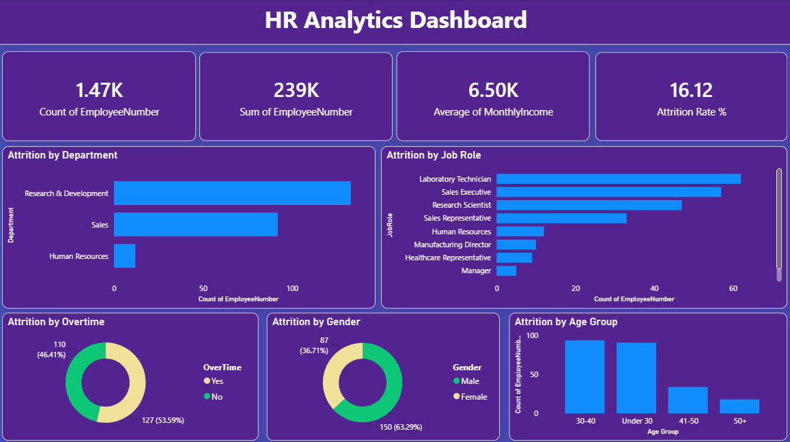

# HR Analytics Dashboard

## Overview

This project analyzes employee attrition using SQL, Python, and Power BI. The goal is to identify workforce trends, attrition drivers, and key HR metrics that can help organizations improve employee retention and make data-driven decisions.

## Tools & Technologies

* SQL (MySQL)
* Python (Pandas, Matplotlib, Seaborn)
* Power BI
* Git & GitHub

## Dataset

IBM HR Analytics Employee Attrition Dataset

* Total Records: 1,470 Employees
* Features: Employee demographics, job role, salary, overtime, department, attrition status, and more.

## Project Workflow

### 1. SQL Analysis

Performed data analysis using SQL queries to:

* Calculate total employees and attrition count
* Compute attrition rate
* Analyze attrition by department
* Analyze attrition by job role
* Evaluate overtime impact on attrition
* Perform salary and workforce analysis

### 2. Python Analysis

Used Python for exploratory data analysis (EDA):

* Data validation and quality checks
* Missing value analysis
* Attrition trend analysis
* Data visualization using Matplotlib and Seaborn

### 3. Power BI Dashboard

Built an interactive dashboard featuring:

* Total Employees
* Attrition Count
* Attrition Rate (%)
* Average Monthly Income
* Attrition by Department
* Attrition by Job Role
* Attrition by Overtime
* Attrition by Gender
* Attrition by Age Group

## Key Insights

* Overall Attrition Rate: **16.12%**
* Employees working overtime showed significantly higher attrition.
* Research & Development and Sales departments experienced the highest employee turnover.
* Certain job roles showed noticeably higher attrition rates.
* Employees under 40 accounted for the majority of attrition cases.

## Dashboard Preview

Upload your dashboard screenshot as **dashboard.png** and add:

```markdown

```

## Project Structure

```text
HR-Analytics-Dashboard
│
├── HR_Employee_Attrition_Cleaned.csv
├── hr_analysis.py
├── hr_analysis_queries.sql
├── HR_Analytics_Dashboard.pbix
├── dashboard.png
└── README.md
```

## Author

**Nishal Chhetri**
Aspiring Data Analyst | SQL | Python | Power BI
